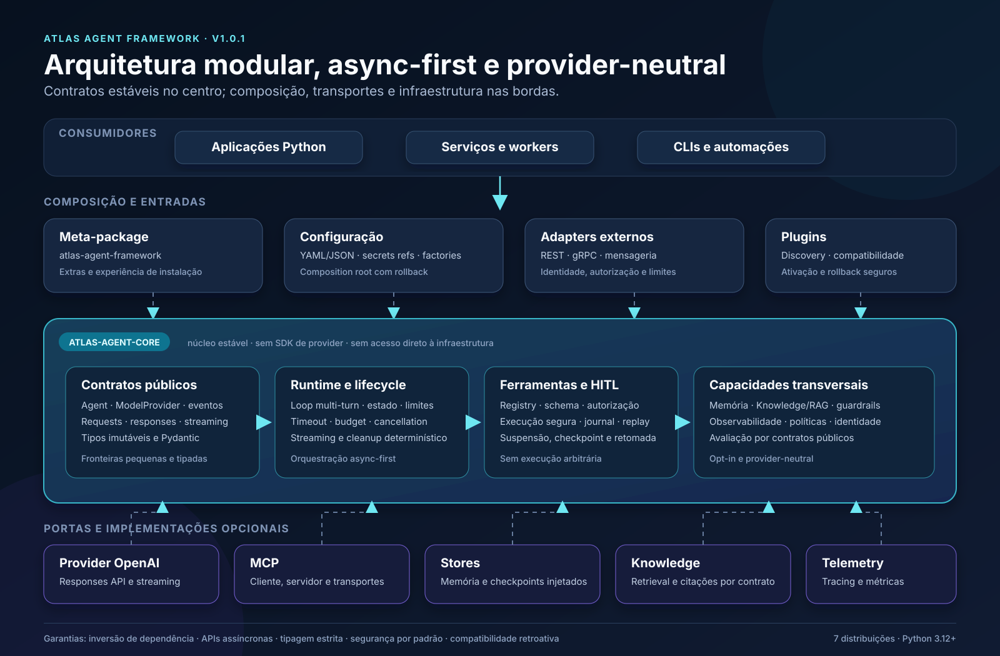
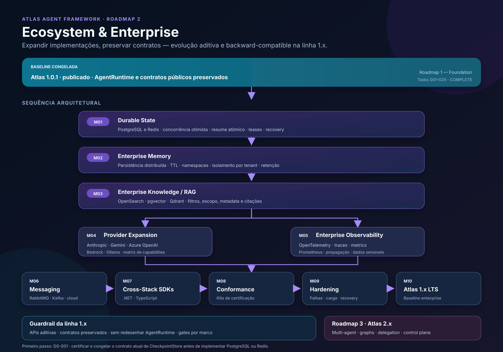

# Arquitetura implementada — Atlas Agent Framework 1.0.1



## Como ler o diagrama

O Atlas foi construído de dentro para fora. O pacote `atlas-agent-core` define
os contratos estáveis e concentra a orquestração provider-neutral. As setas de
dependência apontam das integrações para o core: o núcleo não conhece OpenAI,
FastAPI, gRPC, brokers, bancos, stores ou ferramentas de telemetria concretas.

As aplicações chegam ao framework por APIs Python, configuração declarativa,
adapters externos ou plugins. No centro, `AgentRuntime` coordena lifecycle,
streaming e ciclos multi-turn. Ferramentas, aprovação humana, memória,
Knowledge/RAG, guardrails e observabilidade são integrados por contratos
explícitos e dependências injetadas.

Na borda ficam as implementações substituíveis: provider OpenAI, MCP, stores,
retrieval e telemetria. A avaliação usa os contratos e resultados públicos sem
entrar no caminho crítico do runtime produtivo.

## Distribuições publicadas

| Distribuição | Responsabilidade arquitetural |
| --- | --- |
| `atlas-agent-core` | Contratos, runtime e capacidades provider-neutral |
| `atlas-agent-providers` | Providers oficiais, começando pela OpenAI |
| `atlas-agent-mcp` | Cliente e servidor Model Context Protocol |
| `atlas-agent-adapters` | REST, gRPC, mensageria e persistência PostgreSQL opcional |
| `atlas-agent-config` | Configuração declarativa e composition root |
| `atlas-agent-evaluation` | Datasets, evaluators, scoring e relatórios |
| `atlas-agent-framework` | Meta-package e experiência de instalação |

## Decisões que sustentam o desenho

- inversão de dependência: infraestrutura implementa contratos do core;
- I/O assíncrono e cancellation explícita;
- modelos imutáveis e validação Pydantic nas fronteiras;
- interfaces públicas pequenas, tipadas e compatíveis;
- ferramentas conhecidas, autorizadas e validadas antes da execução;
- conteúdo de memória e retrieval tratado como dado não confiável;
- plugins e integrações opcionais, sem service locator no core;
- observabilidade injetada e fail-open, com defaults no-op;
- nenhuma leitura direta de segredos ou acesso à rede no core.

## Fluxo principal

```text
Aplicação
   ↓
Composição / adapter / plugin
   ↓
AgentRuntime
   ├── lifecycle, estado, limites e policies
   ├── ModelProvider → resposta ou tool call
   ├── ToolExecutor → autorização, validação e execução
   ├── HITL → suspensão, checkpoint e retomada
   └── memória, Knowledge/RAG, guardrails e observabilidade
            ↓
     implementações opcionais nas bordas
```

O resultado é um SDK incorporável: a aplicação escolhe providers, transportes
e infraestrutura sem alterar o modelo público do núcleo.

## Evolução planejada — Roadmap 2



O Roadmap 2 — **Ecosystem & Enterprise** parte da versão `1.0.1` publicada e
mantém o `AgentRuntime` e os contratos públicos como baseline. Sua regra é
**expandir implementações e preservar contratos**. As mudanças da linha `1.x`
devem ser aditivas e backward-compatible; qualquer quebra legítima deve ser
avaliada para o Atlas `2.x`.

### Marcos

| Marco | Evolução planejada | Resultado esperado |
| --- | --- | --- |
| M01 | Durable State | Execuções sobrevivem a restart, falhas e HITL prolongado |
| M02 | Enterprise Memory | Memória persistente, distribuída e isolada por tenant |
| M03 | Enterprise Knowledge / RAG | OpenSearch, pgvector e Qdrant por contratos existentes |
| M04 | Provider Expansion | Anthropic, Gemini, Azure OpenAI, Bedrock e Ollama |
| M05 | Enterprise Observability | OpenTelemetry e métricas operacionais seguras |
| M06 | Messaging & Integration | RabbitMQ, Kafka e serviços de mensageria cloud |
| M07 | Cross-Stack SDKs | Clientes oficiais .NET e TypeScript |
| M08 | Conformance & Certification | Suites oficiais para extensões e integrações |
| M09 | Production Hardening | Recovery, carga, failover e operação em Kubernetes |
| M10 | Atlas 1.x LTS | Baseline enterprise certificada para longo prazo |

### Ordem de dependência

```text
Atlas 1.0.1
    ↓
M01 Durable State
    ↓
M02 Enterprise Memory
    ↓
M03 Enterprise Knowledge
    ├── M04 Provider Expansion
    └── M05 Enterprise Observability
             ↓
       M06 Messaging
             ↓
       M07 Cross-Stack SDKs
             ↓
       M08 Conformance
             ↓
       M09 Production Hardening
             ↓
       M10 Atlas 1.x LTS
```

Cada marco passa por gates de arquitetura, conformidade, segurança, integração
e release. A conclusão exige evidências, compatibilidade verificada e zero
pendências P0/P1.

### Primeiro passo formal

O contrato de persistência foi certificado pela **DS-001 — Persistence Contract
Certification**. A **DS-002 — PostgreSQLCheckpointStore** implementa agora
persistência transacional e consumo único atômico no adapter opcional, sem
introduzir PostgreSQL no core. A propriedade operacional preservada é:

```text
one approval → one resume → one side effect
```

inclusive quando workers concorrentes tentam consumir o mesmo checkpoint.
Essa propriedade representa autorização de retomada no máximo uma vez e não
declara exactly-once para efeitos externos.

A **DS-003 — Checkpoint Optimistic Concurrency** complementa o adapter com uma
revisão de armazenamento independente e compare-and-swap. Essa capability
impede lost updates entre processos sem alterar `CheckpointStore` ou o
`AgentRuntime`.

A **DS-004 — Atomic Resume Consumption** integra o runtime a uma capability
opcional de consumo autorizado. No PostgreSQL, a validação da decisão ocorre na
mesma transação do `DELETE ... RETURNING`, antes do commit. Falhas de identidade,
decisão, modalidade ou cancelamento causam rollback; somente um consumidor
autorizado confirma a remoção. Stores que implementam apenas o contrato 1.x
continuam compatíveis com a semântica histórica.

A **DS-005 — Checkpoint Lease & Ownership** adiciona ownership temporário,
expiração baseada no relógio do PostgreSQL e fencing tokens monotônicos. As
capabilities `compare_and_swap_leased()` e `consume_authorized_leased()`
rejeitam stale workers atomicamente com a alteração protegida, preservando os
contratos 1.x e deixando a coordenação automática de recovery para a DS-006.

Multi-agent runtime, delegation, workflow graphs, coordenação distribuída,
marketplace e control plane hospedado ficam fora deste ciclo. Esses temas são
candidatos ao Roadmap 3 — **Atlas 2.x: Advanced Orchestration**.
