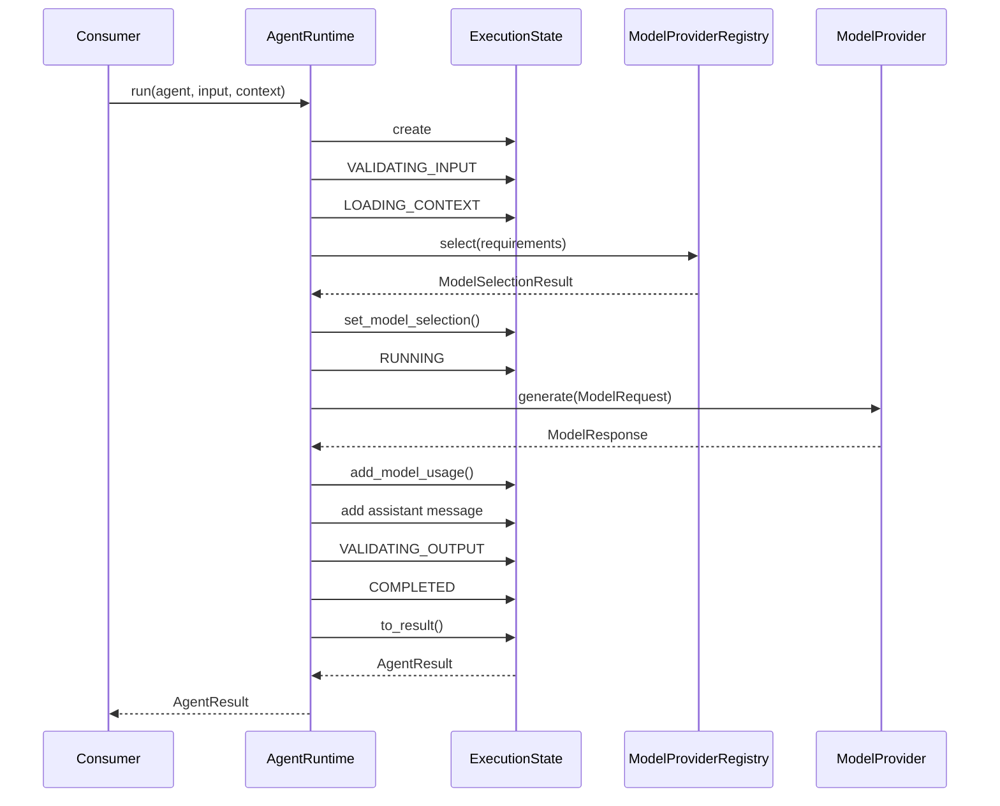

# Runtime de agentes

`AgentRuntime` executa o pipeline provider-agnostic do Atlas. Cada chamada de
`run()` ou `stream()` cria estado e factory de eventos próprios, seleciona um
modelo uma única vez e pode alternar chamadas do modelo com ferramentas até
obter uma resposta terminal ou atingir uma política de execução.

```python
runtime = AgentRuntime(model_registry=registry)

result = await runtime.run(
    agent=definition,
    input_data=AgentInput(message="Explique inversão de dependência."),
    context=AgentContext(execution_id="execution-1"),
    model_selection=ModelSelectionRequest(provider="fake"),  # opcional
    limits=ExecutionLimits(timeout_seconds=30),  # opcional
    budget=ExecutionBudget(max_estimated_cost=Decimal("1.00")),  # opcional
)
```

## Ownership

```text
AgentDefinition = configuração declarativa
Agent            = fachada abstrata compatível
AgentRuntime     = único proprietário do execution loop
ExecutionState   = estado mutável controlado por execução
ModelProvider    = fronteira de interação com o modelo
AgentResult      = resultado público terminal
```

A decisão completa está em
[`ADR-001`](../adr/ADR-001-agent-runtime-execution-ownership.md).

## Pipeline

```text
AgentDefinition
     │
AgentInput
     │
AgentContext
     ▼
AgentRuntime
     │
     ├── ExecutionState
     │
     ├── ModelProviderRegistry
     │       ↓
     │   ModelSelectionResult
     │
     ├── ModelRequestBuilder
     │       ↓
     │   ModelRequest
     │
     ├── ModelProvider.generate()
     │       ↓
     │   ModelResponse
     │       ↓ TOOL_CALL
     ├── ToolExecutor
     │       ↓
     │   ModelMessage(TOOL)
     │
     ├── ou ModelProvider.stream()
     │       ↓
     │   ModelStreamAccumulator → ModelResponse
     │
     └── ExecutionState.to_result()
             ↓
         AgentResult
```



Sem ferramentas, o happy path percorre exatamente:

```text
CREATED → VALIDATING_INPUT → LOADING_CONTEXT → RUNNING
        → VALIDATING_OUTPUT → COMPLETED
```

## Mensagens, attachments e capabilities

`ModelRequestBuilder` cria as mensagens iniciais nesta ordem:

1. `SYSTEM`, com `AgentDefinition.instructions`;
2. `USER`, com `AgentInput.message` e attachments suportados.

Attachments `image/*` viram `ImageContent`; `audio/*` viram `AudioContent`.
Outros media types são rejeitados explicitamente, sem descarte silencioso.

O runtime sempre requer `TEXT_GENERATION`, acrescenta `VISION` para imagens e
`AUDIO_INPUT` para áudio. Requisitos fornecidos pelo caller são unidos aos
obrigatórios; provider, modelo, preferências e limites são preservados. O
caller nunca consegue remover uma capability exigida pelo input.

`stream()` acrescenta também `STREAMING` aos requisitos e não recorre a
`generate()` quando nenhum modelo compatível está disponível.

O request contém somente as tools declaradas em `AgentDefinition.tool_names`,
na ordem da allowlist. Quando ela não está vazia, o runtime exige também
`TOOL_CALLING`. Structured output, temperatura e opções específicas de vendor
continuam fora da construção automática.
`ModelExecutionContext` transporta somente IDs de
correlação e um `request_id` novo, sem metadata ou credenciais do consumidor.

## Eventos

Eventos de status respondem qual transição ocorreu; eventos semânticos indicam
qual operação está sendo executada. Uma execução normal produz:

```text
 1 EXECUTION_CREATED
 2 EXECUTION_STARTED
 3 EXECUTION_STATUS_CHANGED → validating_input
 4 INPUT_VALIDATION_STARTED
 5 INPUT_VALIDATION_COMPLETED
 6 EXECUTION_STATUS_CHANGED → loading_context
 7 CONTEXT_LOADING_STARTED
 8 CONTEXT_LOADING_COMPLETED
 9 EXECUTION_STATUS_CHANGED → running
10 MODEL_EXECUTION_STARTED
11 MODEL_EXECUTION_COMPLETED
12 EXECUTION_STATUS_CHANGED → validating_output
13 OUTPUT_VALIDATION_STARTED
14 OUTPUT_VALIDATION_COMPLETED
15 EXECUTION_STATUS_CHANGED → completed
16 EXECUTION_COMPLETED
```

Cada execução possui sua própria `AgentEventFactory`; sequências começam em 1,
não têm gaps e permanecem independentes em chamadas concorrentes.

No modo incremental, eventos de início, deltas textuais, tool calls, uso e
término do modelo entram no mesmo journal e são entregues imediatamente. O
contrato detalhado está em [runtime-streaming.md](runtime-streaming.md).

## Respostas e uso

Uso reportado é agregado mesmo quando uma resposta válida termina em status
diferente de `COMPLETED`. Sem resposta, nenhum uso é inventado. O contador de
turnos é incrementado imediatamente antes de `generate()` ou da criação do
stream; falha de seleção mantém zero, enquanto qualquer invocação do provider
contabiliza um turno.
`tool_call_count` representa ferramentas efetivamente executadas. Solicitações
desconhecidas, negadas, inválidas ou deduplicadas não incrementam o contador.

Antes da invocação, o runtime verifica `max_turns`; somente depois incrementa o
contador e chama o provider. Após receber a resposta, agrega usage e verifica,
nesta ordem, limites de input, output e total de tokens e então budget. Uma
violação preserva usage, não adiciona a mensagem assistant e não expõe output.
Consulte [execution-limits.md](execution-limits.md).

| `FinishReason` | Status | Política |
| --- | --- | --- |
| `STOP` | `COMPLETED` | concatena conteúdo textual |
| `LENGTH` | `COMPLETED` | aceita texto parcial e sinaliza no evento |
| `TOOL_CALL` | continua o loop | executa o batch sequencialmente e devolve resultados ao modelo |
| `CONTENT_FILTER` | `REJECTED` | bloqueio informado pelo provider |
| `CANCELLED` | `CANCELLED` | retorna resultado cancelado |
| `ERROR` | `FAILED` | `model_error_finish_reason` |
| `UNKNOWN` | `FAILED` | `model_unknown_finish_reason` |

`STOP` ou `LENGTH` sem `TextContent` utilizável termina em `FAILED` com
`model_empty_text_response`. `response.model` é informativo e pode representar
alias ou revisão diferente do modelo solicitado.

## Erros e cancelamento

Erros de seleção, registry e `ModelProviderError` viram `AgentErrorInfo` com
códigos estáveis. Somente provider e modelo seguros entram em `details`; raw
responses, headers, credenciais e stack traces não são expostos. O campo
`retryable` é preservado como informação, mas não dispara retry.

`asyncio.CancelledError` é diferente de uma resposta com finish reason
`CANCELLED`: o runtime tenta registrar `CANCELLED` e seus eventos e então
repropaga a exceção para preservar cancelamento cooperativo.

O fechamento antecipado de `stream()` fecha também o iterador assíncrono do
provider e cancela o estado interno, sem fabricar um resultado que o consumidor
já não poderia receber.

O timeout total é uma política própria baseada em deadline monotônico. Sua
expiração produz `TIMED_OUT` e `AgentResult`; `ModelTimeoutError` do provider
continua sendo `FAILED`, enquanto cancelamento externo continua sendo
repropagado.

## Limites desta versão

Não há retry automático, fallback, reconexão, execução paralela de tools, RAG,
memória, guardrails, previsão de tokens/custo ou provider concreto. Aprovação
humana pode interromper `run()` com `ExecutionSuspension` e ser continuada por
`resume()`; veja [aprovação humana](human-approval.md).
O registry de modelos pode ser compartilhado para leitura, mas não deve ser
alterado durante uma execução. O loop e sua deduplicação por execução estão em
[multi-turn-runtime.md](multi-turn-runtime.md), e a fronteira segura de
ferramentas está em [tools.md](tools.md).
