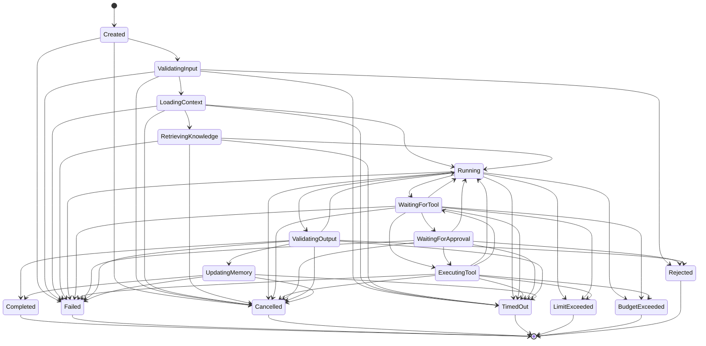

# Lifecycle de execução

O lifecycle formaliza como uma execução muda de estado sem implementar um
runtime. Todas as mudanças passam por `ExecutionLifecycle.transition_to`, que
valida o mapa declarativo, cria uma `ExecutionTransition`, atualiza o estado e
registra o histórico.

## Estados

Toda nova instância de `ExecutionLifecycle` inicia em `CREATED`. O construtor
não aceita outro estado inicial. Estados de processamento representam as fases
previstas do protocolo. Alguns, como `RETRIEVING_KNOWLEDGE`, ainda reservam
evolução futura:

```text
VALIDATING_INPUT
LOADING_CONTEXT
RETRIEVING_KNOWLEDGE
RUNNING
WAITING_FOR_TOOL
EXECUTING_TOOL
WAITING_FOR_APPROVAL
VALIDATING_OUTPUT
UPDATING_MEMORY
```

Os estados terminais são centralizados em `TERMINAL_EXECUTION_STATUSES`:

```text
COMPLETED
FAILED
CANCELLED
TIMED_OUT
LIMIT_EXCEEDED
BUDGET_EXCEEDED
REJECTED
```

Estados terminais não possuem transições de saída. A função `is_terminal`
consulta a mesma definição central.

## Mapa completo de transições

O diagrama abaixo corresponde ao mapa `ALLOWED_TRANSITIONS`. Setas para estados
terminais estão explicitamente representadas; não existe regra permissiva
implícita.



## Lifecycle e histórico

`ExecutionLifecycle` é mutável internamente, mas não oferece setter para
`status`. O histórico interno também não é exposto: a propriedade `history`
retorna uma tupla com snapshots imutáveis na ordem de inserção.

O construtor não oferece atalho para iniciar em outro estado. Isso impede a
criação de lifecycles que ignorem a validação de entrada. A API
`ExecutionLifecycle.restore()` reproduz um histórico validado e é usada pela
retomada de checkpoints, sem criar bypass para transições inválidas.

Os retornos para `RUNNING` representam continuação controlada após ferramenta
indisponível ou reparo de saída. Aprovação válida segue
`WAITING_FOR_APPROVAL → EXECUTING_TOOL`; rejeição segue
`WAITING_FOR_APPROVAL → REJECTED`. `EXECUTING_TOOL → WAITING_FOR_TOOL`
representa processamento sequencial de tool calls pendentes.
`VALIDATING_OUTPUT → REJECTED` é reservado a bloqueio terminal por política.
Se uma policy produzir candidatas de memória, o fechamento segue
`VALIDATING_OUTPUT → UPDATING_MEMORY → COMPLETED`; sem candidatas, segue
diretamente para `COMPLETED`.

Uma tentativa inválida gera `InvalidExecutionTransitionError`, que expõe
`current_status` e `requested_status`. O estado e o histórico permanecem
inalterados quando a transição falha.

## Timestamps

Timestamps fornecidos devem possuir fuso horário. Quando omitido,
`transition_to` utiliza o instante atual em UTC. O timestamp registrado é
preservado no snapshot da transição.

## Eventos e sequenciamento

`AgentEventFactory` pertence a uma única execução e mantém seu contador
localmente. A primeira sequência é `1`; cada evento criado com sucesso incrementa
exatamente uma unidade. Não há contador global, e duas factories mantêm
sequências independentes.

A factory gera `event_id` interno como UUID em formato textual e timestamps em
UTC quando não são fornecidos. `from_transition` converte uma transição em
`EXECUTION_STATUS_CHANGED` com o seguinte payload:

```json
{
  "from_status": "running",
  "to_status": "validating_output",
  "reason": null
}
```

`ExecutionState.transition_to()` reutiliza este mesmo lifecycle e expõe seu
histórico diretamente, sem duplicar status ou transições. O estado não gera
eventos automaticamente: o runtime futuro deverá converter a transição pela
factory e registrar o evento explicitamente. Consulte
[`execution-state.md`](execution-state.md) para as invariantes de mutação.

`AgentRuntime` agora conecta políticas reais aos terminais `TIMED_OUT`,
`LIMIT_EXCEEDED` e `BUDGET_EXCEEDED`. A decisão permanece fora do lifecycle: o
checker apenas descreve violações, o runtime coordena o enforcement e esta
máquina continua responsável exclusivamente por validar a transição. Consulte
[`execution-limits.md`](execution-limits.md).

Uma factory não deve ser compartilhada entre execuções nem entre threads. Esta
tarefa não introduz sincronização, event bus ou mecanismo de entrega.

## Eventos públicos

`AgentEventType` possui valores `snake_case` estáveis para:

- criação, início e mudança de status da execução;
- validação de entrada e saída;
- carregamento de contexto e recuperação de conhecimento;
- execução de modelo e ferramentas;
- aprovação, recuperação e atualização de memória;
- todos os encerramentos terminais.

Esses eventos definem um protocolo. Modelo, ferramentas, aprovação humana e
memória já são coordenados pelo runtime; conhecimento permanece uma fronteira
para evolução futura.
