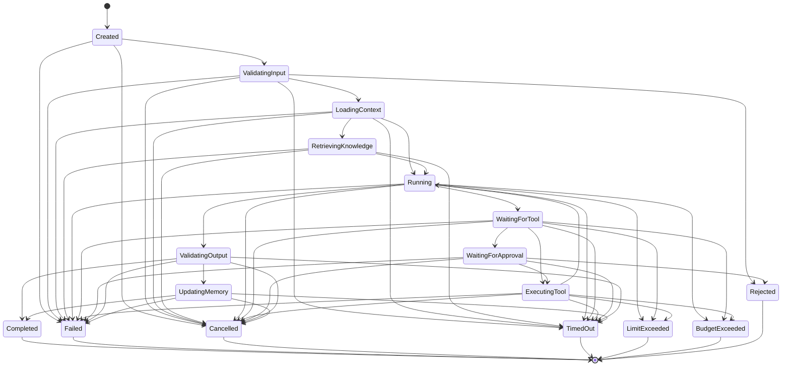

# Lifecycle de execução

O lifecycle formaliza como uma execução muda de estado sem implementar um
runtime. Todas as mudanças passam por `ExecutionLifecycle.transition_to`, que
valida o mapa declarativo, cria uma `ExecutionTransition`, atualiza o estado e
registra o histórico.

## Estados

O estado inicial padrão é `CREATED`. Estados de processamento representam as
fases previstas do protocolo, mesmo quando a funcionalidade correspondente
ainda não foi implementada:

```text
VALIDATING_INPUT
LOADING_CONTEXT
RETRIEVING_KNOWLEDGE
RUNNING
WAITING_FOR_TOOL
EXECUTING_TOOL
WAITING_FOR_APPROVAL
VALIDATING_OUTPUT
UPDATING_MEMORY
```

Os estados terminais são centralizados em `TERMINAL_EXECUTION_STATUSES`:

```text
COMPLETED
FAILED
CANCELLED
TIMED_OUT
LIMIT_EXCEEDED
BUDGET_EXCEEDED
REJECTED
```

Estados terminais não possuem transições de saída. A função `is_terminal`
consulta a mesma definição central.

## Mapa completo de transições

O diagrama abaixo corresponde ao mapa `ALLOWED_TRANSITIONS`. Setas para estados
terminais estão explicitamente representadas; não existe regra permissiva
implícita.



## Lifecycle e histórico

`ExecutionLifecycle` é mutável internamente, mas não oferece setter para
`status`. O histórico interno também não é exposto: a propriedade `history`
retorna uma tupla com snapshots imutáveis na ordem de inserção.

O construtor aceita um estado inicial diferente de `CREATED` para futura
reconstrução de estado. Nesse caso, o histórico começa vazio; a restauração de
histórico e checkpoints pertence a uma tarefa futura.

Uma tentativa inválida gera `InvalidExecutionTransitionError`, que expõe
`current_status` e `requested_status`. O estado e o histórico permanecem
inalterados quando a transição falha.

## Timestamps

Timestamps fornecidos devem possuir fuso horário. Quando omitido,
`transition_to` utiliza o instante atual em UTC. O timestamp registrado é
preservado no snapshot da transição.

## Eventos e sequenciamento

`AgentEventFactory` pertence a uma única execução e mantém seu contador
localmente. A primeira sequência é `1`; cada evento criado com sucesso incrementa
exatamente uma unidade. Não há contador global, e duas factories mantêm
sequências independentes.

A factory gera `event_id` interno como UUID em formato textual e timestamps em
UTC quando não são fornecidos. `from_transition` converte uma transição em
`EXECUTION_STATUS_CHANGED` com o seguinte payload:

```json
{
  "from_status": "running",
  "to_status": "validating_output",
  "reason": null
}
```

Uma factory não deve ser compartilhada entre execuções nem entre threads. Esta
tarefa não introduz sincronização, event bus ou mecanismo de entrega.

## Eventos públicos

`AgentEventType` possui valores `snake_case` estáveis para:

- criação, início e mudança de status da execução;
- validação de entrada e saída;
- carregamento de contexto e recuperação de conhecimento;
- execução de modelo e ferramentas;
- aprovação e atualização de memória;
- todos os encerramentos terminais.

Esses eventos definem um protocolo. Eles não significam que providers,
ferramentas, aprovação, conhecimento ou memória já estejam implementados.
