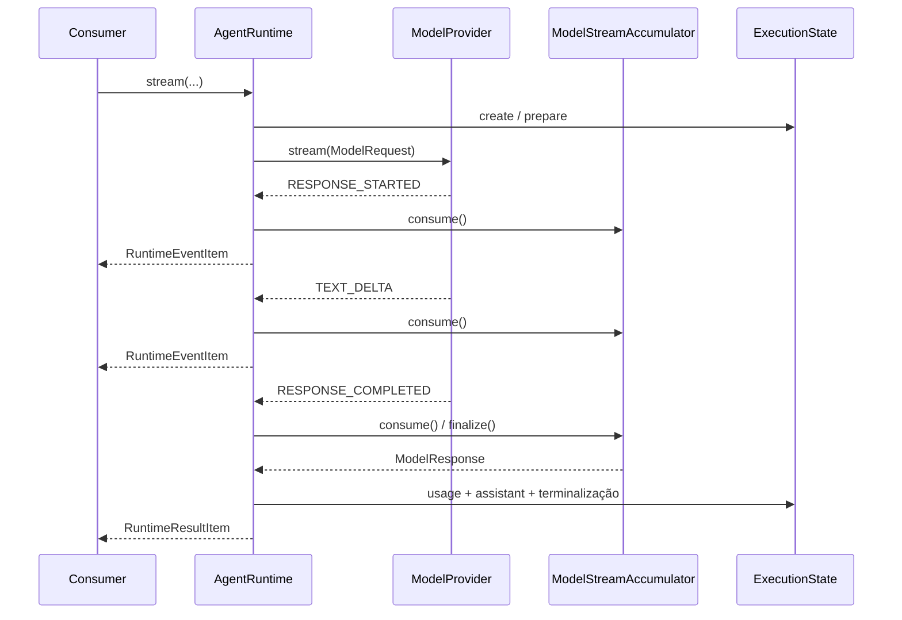

# Streaming do runtime

`AgentRuntime.stream()` executa chamadas sucessivas a `ModelProvider.stream()`
quando o modelo solicita ferramentas e expõe todo o progresso sem depender de
um SDK concreto. O retorno é um
`AsyncIterator[RuntimeStreamItem]`: cada item intermediário é um
`RuntimeEventItem`, e o último item é sempre um único `RuntimeResultItem` quando
a iteração termina normalmente.

```python
async for item in runtime.stream(
    agent=definition,
    input_data=AgentInput(message="Explique streaming."),
    context=AgentContext(execution_id="execution-1"),
    limits=ExecutionLimits(timeout_seconds=30, max_total_tokens=12_000),
    budget=ExecutionBudget(max_estimated_cost=Decimal("1.00")),
):
    if item.type == "event":
        process_event(item.event)
    else:
        result = item.result
```

Os itens são modelos imutáveis e formam uma união discriminada pelo campo
`type`. O consumidor não precisa inspecionar objetos específicos do provider.

## Seleção e execução

O modo streaming acrescenta `STREAMING` às capabilities obrigatórias derivadas
do input. Um modelo sem essa capability não é selecionado, inclusive quando o
caller informa provider e modelo explicitamente. Não existe fallback para
`generate()`, reconexão ou retry: todos os turnos incrementais usam
exclusivamente `stream()` e cada novo stream contabiliza um turno.

Validação de input, construção das mensagens, seleção, contexto do modelo,
política de `FinishReason` e estados terminais são compartilhados com `run()`.
As duas APIs compartilham o mesmo loop; diferem somente na forma de obter e
entregar cada resposta do modelo.

```text
Consumer
   │
   ▼
AgentRuntime.stream()
   ├── ExecutionState
   ├── ModelProviderRegistry
   └── ModelRequest
          │
          ▼
   ModelProvider.stream()
          │
          ▼
   ModelStreamEvent
     ├── mapping → RuntimeEventItem → Consumer
     └── ModelStreamAccumulator
                   │
                   ▼
              ModelResponse
                   │
                   ▼
               AgentResult
                   │
                   ▼
           RuntimeResultItem
```

## Protocolo recebido

`ModelStreamAccumulator` reconstrói a resposta final de forma determinística:

- a sequência começa em `1` e permanece contígua, sem gaps ou duplicatas;
- o primeiro evento é um único `RESPONSE_STARTED`;
- `response_id` e identidade do modelo não podem mudar durante o stream;
- deltas de texto são concatenados exatamente na ordem recebida, inclusive
  strings vazias, espaços, quebras de linha e Unicode;
- tool calls podem ser intercaladas, mas cada uma precisa ser iniciada e
  concluída uma única vez;
- `TOOL_CALL_COMPLETED` contém o `ToolCall` final já normalizado pelo adapter;
- eventos de uso são snapshots cumulativos: o mais recente substitui o
  anterior, e o uso final em `RESPONSE_COMPLETED` tem precedência;
- existe exatamente um terminal, `RESPONSE_COMPLETED` ou `ERROR`, e nenhum
  evento é aceito depois dele.

O término do iterador sem terminal gera `incomplete_model_stream`. Sequência
inválida, violação de protocolo e erro terminal do provider também viram
resultados `FAILED` com códigos públicos estáveis. Uso ausente permanece zero;
ele não é estimado pelo core.

## Eventos públicos

Os eventos de modelo são convertidos para o vocabulário do runtime e entregues
assim que validados:

| Evento do modelo | Evento do agente |
| --- | --- |
| `RESPONSE_STARTED` | `MODEL_STREAM_STARTED` |
| `TEXT_DELTA` | `MODEL_TEXT_DELTA` |
| `TOOL_CALL_STARTED` | `MODEL_TOOL_CALL_STARTED` |
| `TOOL_CALL_ARGUMENT_DELTA` | `MODEL_TOOL_CALL_ARGUMENT_DELTA` |
| `TOOL_CALL_COMPLETED` | `MODEL_TOOL_CALL_COMPLETED` |
| `USAGE_UPDATED` | `MODEL_USAGE_UPDATED` |
| `RESPONSE_COMPLETED` ou `ERROR` | `MODEL_STREAM_COMPLETED` |

A sequência de `AgentEvent` continua monotônica por execução. O
`RuntimeResultItem` final contém o mesmo journal completo que foi entregue nos
itens anteriores. O runtime respeita backpressure: ele solicita o próximo
evento ao provider apenas quando o consumidor avança o iterador.



## Cancelamento e fechamento antecipado

`asyncio.CancelledError` é registrado internamente como cancelamento e
repropagado. Se o consumidor fechar o iterador antes do fim, o runtime fecha o
iterador assíncrono do provider e leva seu estado interno a `CANCELLED`. Nesse
caso não há item final, pois o próprio consumidor interrompeu o canal de saída.

O timeout do runtime usa um deadline absoluto e produz normalmente um
`RuntimeResultItem` com status `TIMED_OUT`. Cada espera pelo próximo evento usa
o tempo restante; eventos recebidos não reiniciam o prazo. Limites de tokens e
budget são avaliados após a resposta final reconstruída. Deltas já observados
não podem ser retirados, mas o resultado terminal fica sem output e sem nova
mensagem assistant. Consulte [execution-limits.md](execution-limits.md).

Quando a resposta reconstruída termina em `TOOL_CALL`, o runtime executa o
batch sequencialmente, acrescenta as mensagens `ASSISTANT` e `TOOL` ao histórico
e abre outro stream. Eventos de ferramentas e de modelo compartilham o mesmo
journal. Consulte [multi-turn-runtime.md](multi-turn-runtime.md).

## Suspensão e retomada

Quando uma tool exige decisão humana, `RuntimeSuspensionItem` encerra a
invocação atual sem `RuntimeResultItem`. `resume_stream()` consome o checkpoint
e continua somente com `ModelProvider.stream()`, mantendo a sequência de
eventos; checkpoints incrementais não podem ser retomados por `resume()`.
Consulte [aprovação humana](human-approval.md).

## Limites

Esta versão não oferece retry, fallback, reconexão, tools paralelas, memória,
RAG, guardrails ou provider concreto.
